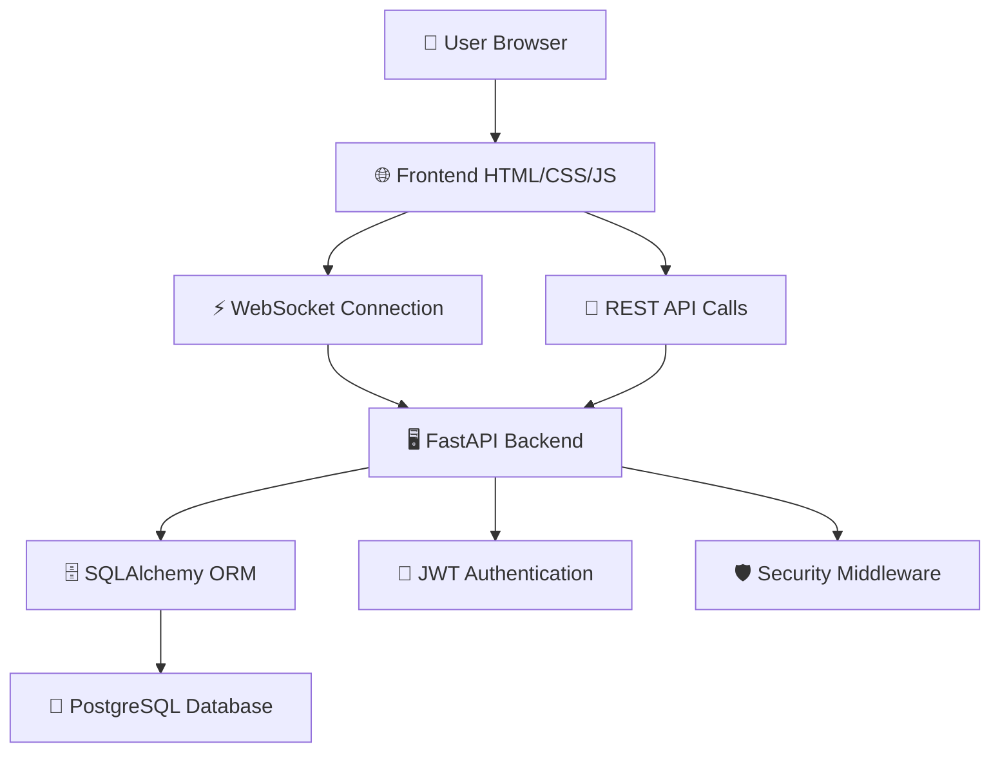

# 🚀 SwiftChat

SwiftChat is a modern real-time chat application built with **FastAPI**, **WebSockets**, and **Neon PostgreSQL**.  
Features **JWT authentication**, **live messaging**, **chat room management**, and **persistent chat history**.

## ✨ Features

- 🔐 **User Authentication** - Secure registration and login with JWT tokens
- 💬 **Real-time Messaging** - Instant messaging with WebSocket connections
- 🏠 **Chat Rooms** - Create and join different chat rooms
- 📱 **Responsive UI** - Clean, modern interface that works on all devices
- 💾 **Message Persistence** - Chat history stored in PostgreSQL database
- 🚀 **Single-Service Deployment** - Frontend and backend served together
- 🔒 **Secure** - Password hashing with bcrypt and JWT token authentication

## 🛠️ Tech Stack

<div align="center">

### 🖥️ **Backend Technologies**
| Technology | Purpose | Features |
|------------|---------|----------|
| **🐍 FastAPI** | Web Framework | High-performance async API, Auto-documentation, Type hints |
| **🗄️ SQLAlchemy** | Database ORM | Advanced querying, Relationship mapping, Migration support |
| **🐘 PostgreSQL (Neon)** | Cloud Database | Serverless, Auto-scaling, High availability |
| **⚡ WebSockets** | Real-time Communication | Bi-directional, Low latency, Event-driven |
| **🔐 JWT** | Authentication | Stateless, Secure, Token-based auth |
| **🛡️ bcrypt** | Password Security | Adaptive hashing, Salt generation, Brute-force resistant |
| **🔧 Uvicorn** | ASGI Server | High performance, Production ready, Hot reload |
| **📦 Pydantic** | Data Validation | Type validation, Serialization, Auto-documentation |

### 🎨 **Frontend Technologies**
| Technology | Purpose | Features |
|------------|---------|----------|
| **🌐 HTML5** | Structure | Semantic markup, Accessibility, Modern standards |
| **🎨 CSS3** | Styling | Flexbox/Grid, Animations, Responsive design |
| **⚡ Vanilla JavaScript** | Interactivity | WebSocket client, Async/await, DOM manipulation |
| **📱 Responsive Design** | Mobile Support | Adaptive layouts, Touch-friendly, Cross-browser |

### ☁️ **Infrastructure & Deployment**
| Technology | Purpose | Features |
|------------|---------|----------|
| **🚀 Render** | Hosting Platform | Free tier, Auto-deploy, HTTPS, Global CDN |
| **🌍 Neon** | Database Hosting | Serverless PostgreSQL, Branching, Auto-scaling |
| **🔄 Git** | Version Control | Distributed, Branching, Collaboration |
| **🐙 GitHub** | Code Repository | CI/CD integration, Issue tracking, Pull requests |

### 🛡️ **Security & Performance**
| Feature | Implementation | Benefit |
|---------|---------------|---------|
| **🔒 CORS Protection** | FastAPI Middleware | Cross-origin security |
| **🛡️ SQL Injection Prevention** | SQLAlchemy ORM | Parameterized queries |
| **🔐 Environment Variables** | python-dotenv | Secure configuration |
| **⚡ Async Architecture** | FastAPI + Uvicorn | High concurrency |
| **🚀 Static File Serving** | FastAPI StaticFiles | Optimized delivery |

</div>

### 🏗️ **Architecture Overview**



## 📁 Project Structure

```
SwiftChat/
├── app/
│   ├── __init__.py
│   ├── main.py           # FastAPI app with static serving
│   ├── config.py         # Environment configuration
│   ├── database.py       # Database connection
│   ├── models.py         # SQLAlchemy models
│   ├── schemas.py        # Pydantic schemas
│   ├── websocket.py      # WebSocket handling
│   └── routes/
│       ├── auth.py       # Authentication endpoints
│       └── chat.py       # Chat endpoints
├── frontend/
│   ├── login.html        # Login page
│   ├── register.html     # Registration page
│   ├── chat.html         # Chat interface
│   └── styles.css        # Shared styles
├── requirements.txt      # Python dependencies
├── .env                  # Environment variables
└── README.md
```

## 🚀 Quick Start

### Prerequisites
- Python 3.8+
- PostgreSQL database (or Neon account)

### Local Development

1. **Clone the repository**
   ```bash
   git clone <your-repo-url>
   cd SwiftChat
   ```

2. **Install dependencies**
   ```bash
   pip install -r requirements.txt
   ```

3. **Set up environment variables**
   ```bash
   cp .env.example .env
   # Edit .env with your database credentials
   ```

4. **Run the application**
   ```bash
   uvicorn app.main:app --reload --host 0.0.0.0 --port 8000
   ```

5. **Access the application**
   - Open your browser to `http://localhost:8000`
   - Register a new account or login
   - Start chatting!

## 🌐 Deployment (Render)

### Backend + Frontend (Single Service)

1. **Push to GitHub**
   ```bash
   git add .
   git commit -m "Ready for deployment"
   git push origin main
   ```

2. **Create Render Web Service**
   - Connect your GitHub repository
   - **Build Command**: `pip install -r requirements.txt`
   - **Start Command**: `uvicorn app.main:app --host 0.0.0.0 --port $PORT`

3. **Environment Variables**
   ```
   DATABASE_URL=postgresql://your-neon-db-url
   JWT_SECRET=your-super-secret-jwt-key
   ENVIRONMENT=production
   DEBUG=False
   ```

4. **Access your deployed app**
   - Frontend: `https://your-app.onrender.com/`
   - API Docs: `https://your-app.onrender.com/docs`

## 🔧 API Endpoints

### Authentication
- `POST /auth/register` - Register new user
- `POST /auth/login` - User login

### Chat
- `GET /chat/messages/{room_id}` - Get chat history
- `POST /chat/messages/` - Send message
- `WS /ws/chat/{room_id}` - WebSocket connection

### System
- `GET /health` - Health check
- `GET /docs` - API documentation

## 🎮 Usage

1. **Register** a new account with username, email, and password
2. **Login** with your credentials
3. **Enter a room ID** (any number) to join a chat room
4. **Start messaging** - messages are delivered in real-time
5. **View history** - previous messages are loaded automatically

## 🔒 Security Features

- **Password Hashing** with bcrypt
- **JWT Token Authentication**
- **CORS Protection**
- **SQL Injection Prevention** with SQLAlchemy ORM
- **Environment Variable Security**

## 🤝 Contributing

1. Fork the repository
2. Create a feature branch (`git checkout -b feature/amazing-feature`)
3. Commit your changes (`git commit -m 'Add amazing feature'`)
4. Push to the branch (`git push origin feature/amazing-feature`)
5. Open a Pull Request

## 📝 License

This project is licensed under the MIT License - see the [LICENSE](LICENSE) file for details.

## 🙏 Acknowledgments

- **FastAPI** for the excellent web framework
- **Neon** for managed PostgreSQL hosting
- **Render** for easy deployment platform

---

**Built with ❤️ by [Sudipta Sarkar]**

> **Live Demo**: [SwiftChat on Render](https://swiftchat-dlt7.onrender.com)